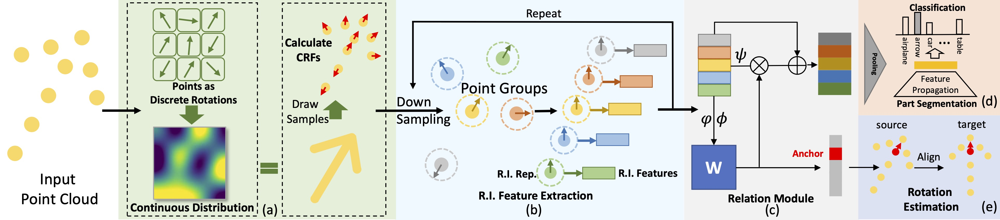

<h1 align="center">
CRIN: Rotation-Invariant Point Cloud Analysis and Rotation Estimation via Centrifugal Reference Frame
</h1>


<div align="center">
<h3>
<a href="https://yokinglou.github.io">Yujing Lou</a>, Zelin Ye, <a href="https://qq456cvb.github.io">Yang You</a>, Nianjuan Jiang, Jiangbo Lu, Weiming Wang, <a href="https://dmcv.sjtu.edu.cn/">Lizhuang Ma</a>, <a href="https://www.mvig.org/">Cewu Lu</a>
<br>
<br>
<a href='#'>
  
</a>
<a href='#'>
  
</a>
<a href='#'>
  
</a>
<br>
</h3>
</div>

<p align='center'>
 </img>
</p>
 
In this paper, we propose the CRIN, namely Centrifugal Rotation-Invariant Network. CRIN directly takes the coordinates of points as input and transforms local points into rotation-invariant representations via centrifugal reference frames. Aided by centrifugal reference frames, each point corresponds to a discrete rotation so that the information of rotations can be implicitly stored in point features. Unfortunately, discrete points are far from describing the whole rotation space. We further introduce a continuous distribution for 3D rotations based on points. Furthermore, we propose an attention-based down-sampling strategy to sample points invariant to rotations. A relation module is adopted at last for reinforcing the long-range dependencies between sampled points and predicts the anchor point for unsupervised rotation estimation. Extensive experiments show that our method achieves rotation invariance, accurately estimates the object rotation, and obtains state-of-the-art results on rotation-augmented classification and part segmentation. Ablation studies validate the effectiveness of the network design.


## Code
Coming soon.

## Citation
```
@inproceedings{lou2023crin,
  title={CRIN: Rotation-Invariant Point Cloud Analysis and Rotation Estimation via Centrifugal Reference Frame},
  author={Lou, Yujing and Ye, Zelin and You, Yang and  Jiang, Nianjuan and Lu, Jiangbo and Wang, Weiming and Ma, Lizhuang and Lu, Cewu},
  booktitle={Proceedings of the AAAI Conference on Artificial Intelligence},
  volume={37},
  year={2023}
}
```